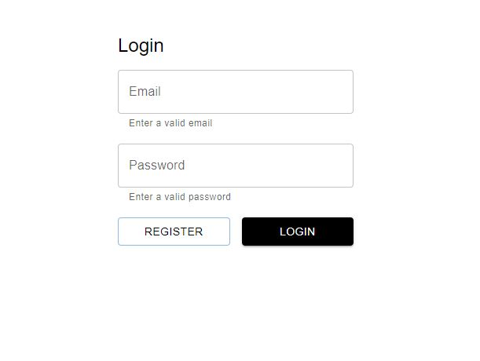
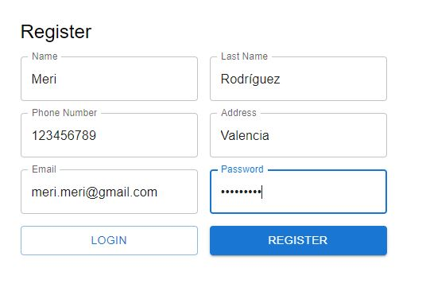
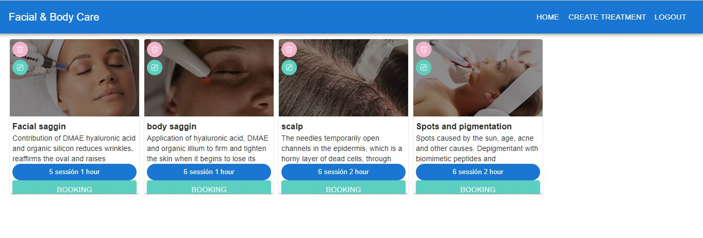
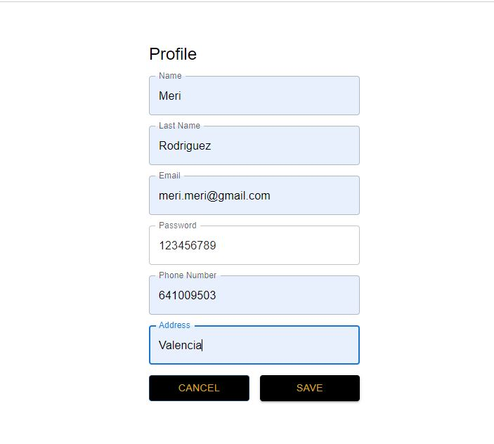
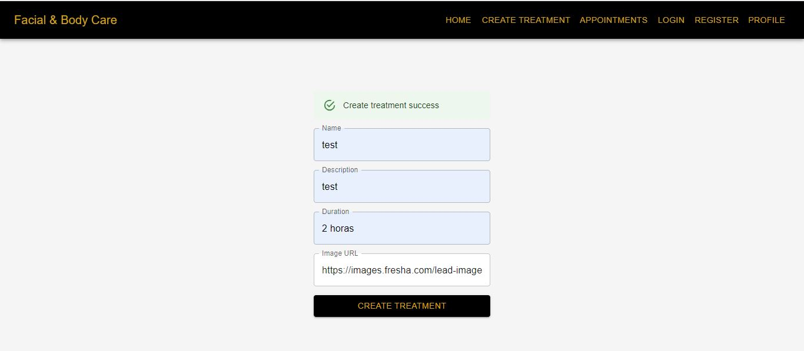
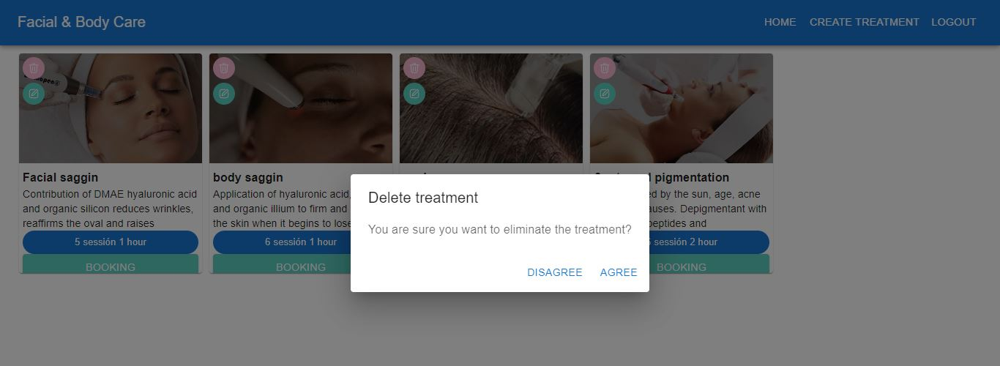
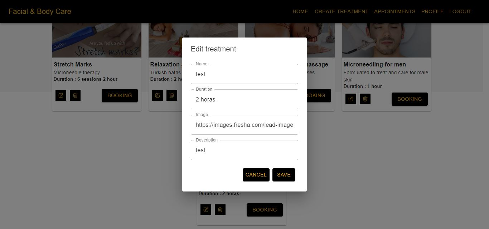

<h1 align="center">Appointments booking System</h1>​
​
<h2 align="center">Frontend for centre esthetics facial & body care</h2>

## Table of contents

- Title project
- Project description
- Wiews
- Technologies Used
- Licence and copyright

### Project descriptión

I have developed a frontend web application to simulate the management of appointments in a beauty center, using the tools of React vite, mui core, mysql wokbench, postman to generate different managements. New users must register and log in, then they will be able to see the different treatments to schedule an appointment, view their profile. Users with the admin role will be able to see all treatments, create, update and delete them.

### Views

LOGIN

REGISTER

HOME

PROFILE

### CRUD treatmen admin

CREATE TREATMENT

DELETE TREATMENT

EDIT TREATMENT

### Technologies Used

 

### Licence and copyright

📝 The copyright belongs to me Meriyen Rodríguez, in this web application proposed by the Geekshubs academy as the first frontend version.
